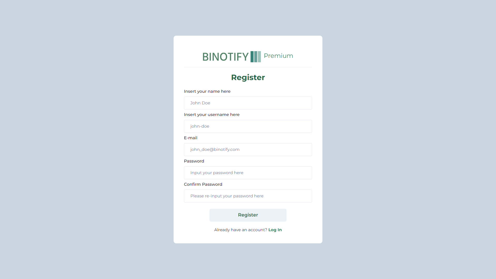
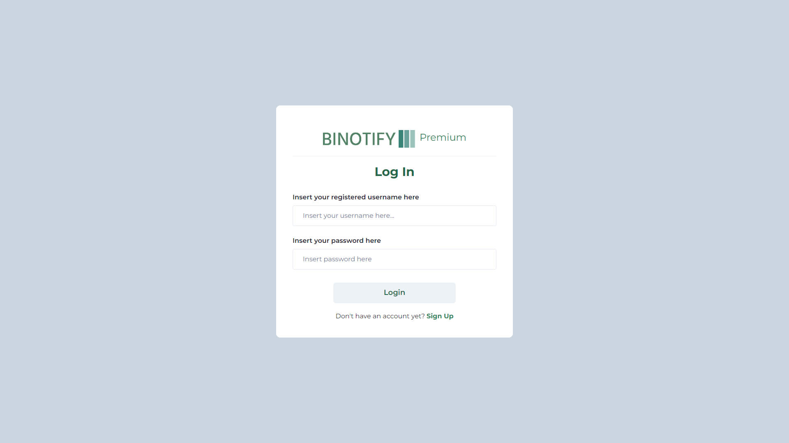
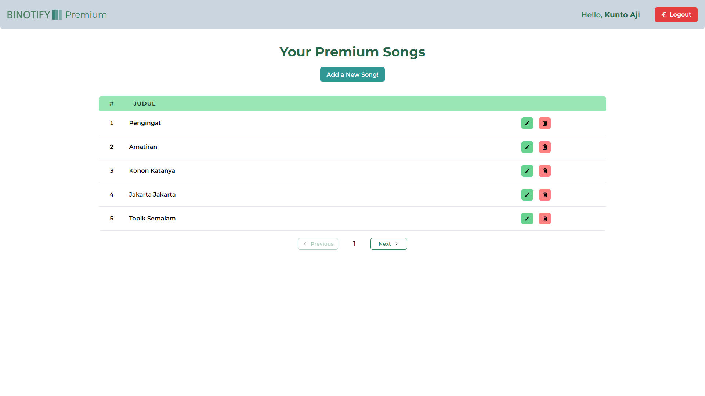
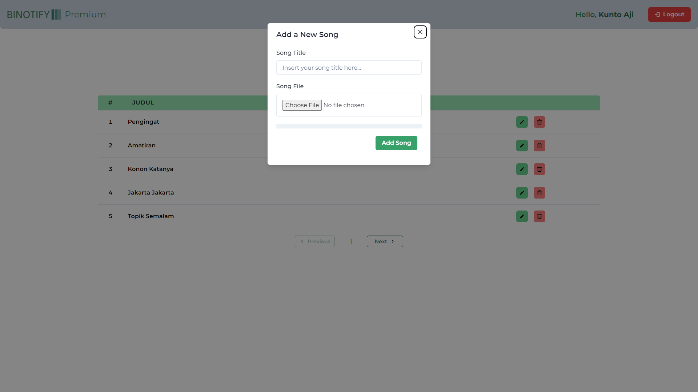
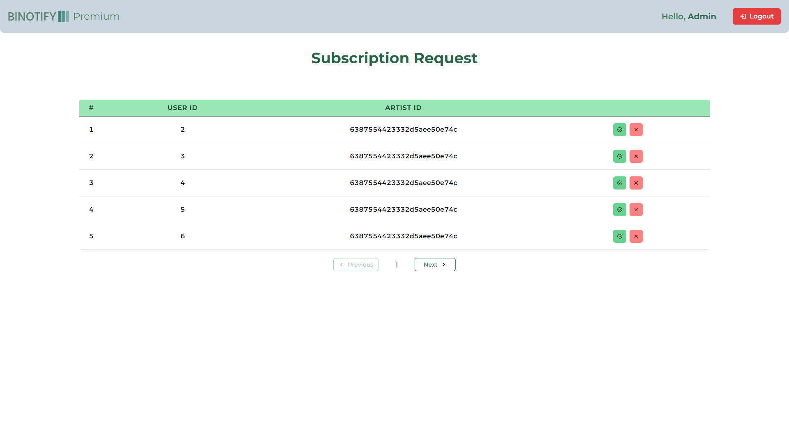

# BiNotify Premium: Web Services untuk aplikasi BiNotify menggunakan _SOAP_ dan _REST_

> Implementasi untuk Tugas Besar 2 IF3110 Pengembangan Berbasis Web, Prodi Informatika ITB Tahun Ajaran 2022/2023

## Deskripsi

BiNotify Premium adalah sebuah Web Services untuk mendukung aplikasi BiNotify. Aplikasi ini hanya dapat diakses oleh Penyanyi atau Admin. Penyanyi dapat mengelola lagu premium yang ia tawarkan. Penyanyi dapat menambahkan lagu premium baru beserta dengan file audionya. Penyanyi juga dapat mengubah atau menghapus lagu tersebut.

Ketika pengguna menambahkan subscription baru ke Penyanyi, permintaan tersebut akan ditampilkan di dalam BiNotify Premium. Daftar permintaan tersebut hanya dapat dikelola oleh Admin. Admin memiliki hak untuk menerima atau menolak permintaan subscription dari pengguna.

BiNotify Premium dibangun menggunakan bahasa pemrograman Typescript dengan framework ReactJS dan Vite di bagian _client side_. Komunikasi antara _client_ dengan _server_ dilakukan dengan paradigma _request/response_ secara _asynchronous_ dengan perantara axios. Penanganan _state_ dilakukan menggunakan session storage di sisi _client_.

## Daftar _Requirement_

Perangkat lunak yang dibutuhkan untuk bisa mengoperasikan BiNotify adalah:

- Docker versi 20.10.21, <a href = "https://docs.docker.com/engine/install/">_panduan instalasi_ </a>
- Docker Compose versi 1.26.2, <a href = "https://docs.docker.com/compose/install/">_panduan instalasi_ </a>
- Node Package Manager (NPM) versi 8.15.0, <a href = "https://docs.npmjs.com/downloading-and-installing-node-js-and-npm">_panduan instalasi_ </a>
- _Operating system_ berbasis _Windows 10_ atau _Linux Ubuntu 20.04_

## Cara Menjalankan

Untuk dapat menjalankan aplikasi BiNotify Premium, service docker pada ketiga repository di bawah ini harus dijalankan secara berurutan:

- <a href = "https://gitlab.informatika.org/if3110-2022-k01-02-11/binotify-config">BiNotify Config</a>
- <a href = "https://gitlab.informatika.org/if3110-2022-k01-02-11/binotify-soap">BiNotify SOAP</a>
- <a href = "https://gitlab.informatika.org/if3110-2022-k01-02-11/binotify-rest">BiNotify REST</a>

Terdapat 2 alternatif untuk menjalankan aplikasi BiNotify Premium, yaitu

#### 1. Lokal

Install package yang dibutuhkan dengan perintah

```
npm install
```

Lalu jalankan aplikasi dengan perintah

```
npm run dev
```

Jika berhasil dijalankan, aplikasi BiNotify Premium dapat diakses pada `localhost:8000`

#### 2. Docker

Instalasi dapat digunakan menggunakan perintah `docker-compose` seperti berikut:

```
docker-compose down && docker-compose build && docker-compose up
```

Jika berhasil dijalankan, aplikasi BiNotify Premium dapat diakses pada `localhost:8000`

Apabila proses instalasi tidak berhasil karena _port_ yang digunakan sedang digunakan untuk proses lain, _port_ dapat diganti pada konfigurasi `docker-compose.yml`

Berikut adalah contoh kredensial user untuk keperluan pengujian:

```
-- untuk user penyanyi
Username: kuntoaji
Password: kuntoaji

-- untuk user admin
Username: admin
Password: admin
```

## _Screenshot_

### Halaman Register



### Halaman Login



### Halaman Daftar Lagu Premium

Halaman ini hanya dapat diakses oleh Penyanyi



### Halaman Upload dan Edit Lagu Premium

Halaman ini hanya dapat diakses oleh Penyanyi



### Halaman Daftar Permintaan Subscription

Halaman ini hanya dapat diakses oleh Admin



## Pembagian Tugas

Secara umum, pembagian tugas dilakukan dengan setiap anggota melakukan pengembangan di _client side_ berdasarkan _groundwork_ yang sudah dibuat. Pengecualian terkhusus pada pembuatan komponen _reusable_ yang digunakan bersama.

Legenda NIM adalah sebagai berikut:

- 13520043: Muhammad Risqi Firdaus
- 13520117: Hafidz Nur Rahman Ghozali
- 13520124: Owen Christian Wijaya

### Client Side

- Halaman Login + Register: 13520043 + 13520117 + 13520124
- Halaman Home + Header: 13520117 + 13520124
- Halaman Daftar Lagu Premium: 13520043 + 13520117 + 13520124
- Halaman Upload Lagu Premium: 13520124
- Halaman Daftar Subscription: 13520043 + 13520117 + 13520124
